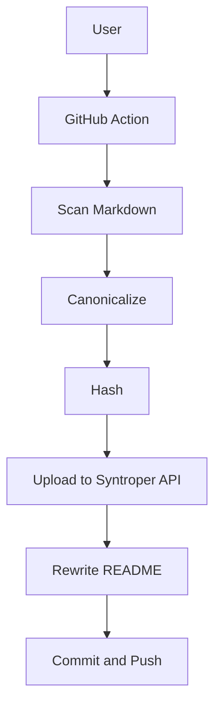
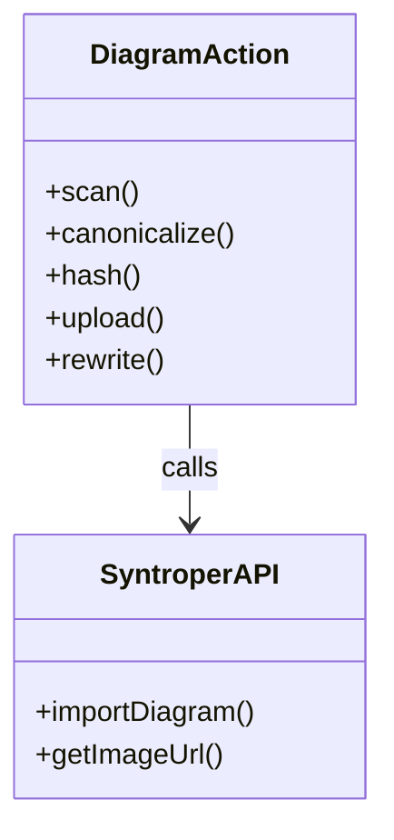
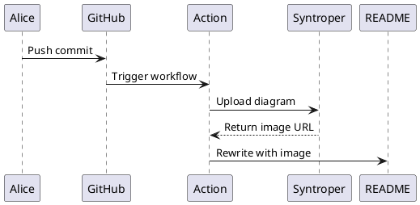
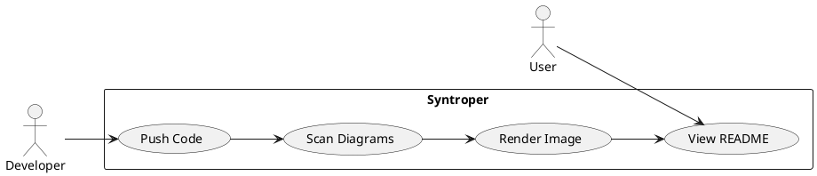

# Syntroper Diagram Test Suite

This repo tests all supported diagram types and engines.

---

<!-- MERMAID: Flowchart -->
## 1. Mermaid - Flowchart



---

<!-- MERMAID: Sequence -->
## 2. Mermaid - Sequence Diagram


---

<!-- MERMAID: Class Diagram -->
## 3. Mermaid - Class Diagram



---

<!-- PLANTUML: Sequence -->
## 4. PlantUML - Sequence Diagram



---

<!-- PLANTUML puml alias -->
## 5. PlantUML puml - Use Case Diagram



---

<!-- DITAA -->
## 6. Ditaa - Simple Architecture

```ditaa
+--------+   +--------+   +--------+
| Client |-->| Server |-->|   DB   |
+--------+   +--------+   +--------+
```

---

<!-- ASCII -->
## 7. ASCII - Architecture Overview

```ascii
+------------------+   +------------------+   +------------------+
|   Developer      |   |  GitHub Action    |   |  Syntroper API   |
|                  |   |                  |   |                  |
|  Push commit     +-->+  Scan and Hash   +-->+  Render diagram  |
|                  |   |                  |   |                  |
|                  |   |  Rewrite README  +<--+  Return image    |
+------------------+   +------------------+   +------------------+
```

---

## Footer (Push 4 - verify API receives hashes)

All 7 diagram blocks cover:
- Engines: mermaid, plantuml, puml, ditaa, ascii
- Types: flowchart, sequence, class, use case, ditaa, ASCII art
