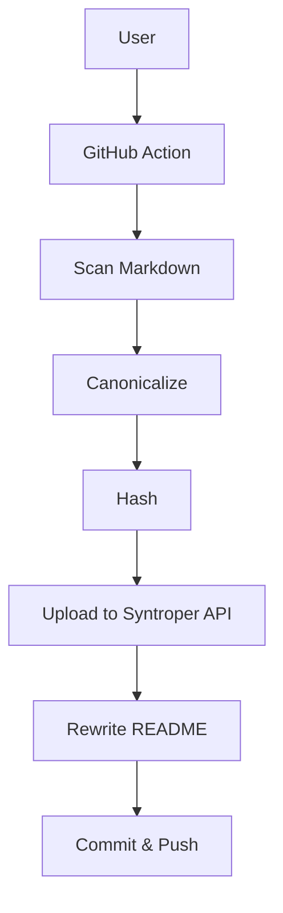
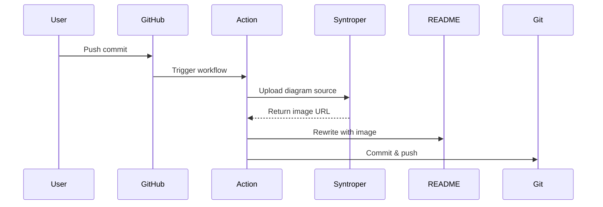

# Syntroper Diagram Test Suite

This repo tests all supported diagram types and engines.

---

<!-- ===================== -->
<!-- MERMAID: Flowchart     -->
<!-- ===================== -->
## 1. Mermaid — Flowchart



---

<!-- ===================== -->
<!-- MERMAID: Sequence      -->
<!-- ===================== -->
## 2. Mermaid — Sequence Diagram



---

<!-- ===================== -->
<!-- MERMAID: General/Other -->
<!-- ===================== -->
## 3. Mermaid — Class Diagram (General)

```mermaid
classDiagram
    cl# Syntroper Diagram Test Suitsc
This repo tests all supporte   
---

<!-- ===================== -->
<!-- MERMAID: Flow
    cla<!-- MERMAID: Flowchart     -po<!-- =============  +getImageUrl## 1   }
    DiagramAction --> 
```mermaid
graph TD
  A[U---graph TD
==  A[Use==  B --> C[Scan MarPLANTUML: Sequence     -->
<!-- ======  D --> E[Hash]
  E -- 4  E --> F[Uplo S  F --> G[Rewrite README]
  G -->rt  G --> H[Commit & Push]sh```

---

<!-- ========n 
-Tri
ger workflow
Action -> Syntroper : <!-- ===================== -->ct## 2. Mermaid — Sequence Di -
```mermaid
sequenceDiagram
    Udumsequenc---
    User->>Git==    GitHub->>Action: Trigger  (    Action-  -->
<!-- ================    Syntroper-->>Action: Return image URLase D    Action->>README: Rewrite with image
 t    Action->>Git: Commit & push
```

-el```

---

<!-- ===============em
-{
 
< us<!-- MERMAID: General/Other -us<!-- ===================== -->  ## 3. Mermaid — Class Diagr3

```mermaid
classDiagram
    cl4
}
User --> UC4
Develo    cl# Syn
UThis repo tests all supporte   
---
en---

<!-- ======================
<===<!-- MERMAID: Flow
    cla<!-      cla<!-- MERMA==    DiagramAction --> 
```meASCII — Architecture Overview

```ascii
+--------```mermaid
graph TD
 --graph TD
--  A[U--  ==  A[Use==  B --<!-- ======  D --> E[Hash]
  E -- 4  E --> F[Uplo S  F    E -- 4  E --> F[ API  |
|  G -->rt  G --> H[Commi  |                  |    
---

<!-- ========n 
-Tri
ger workflt  
< +--Tri
ger workf& gerh Action -> S>+```mermaid
sequenceDiagram
    Udumsequenc---
    User->>Git==    GitHub->>A          sequenceD|     Udumsequen      User->>Git== te<!-- ================    Syntroper-->>Action: Return image URL   t    Action->>Git: Commit & push
```

-el```

---

<!-- ===============em
-{iagram blocks above cover:
- *```

-el```

---

<!-- =========uml, as
---
 **
<agr-{
 
< us<!-- MERMAID,  equence, class, use case, ASCII art
