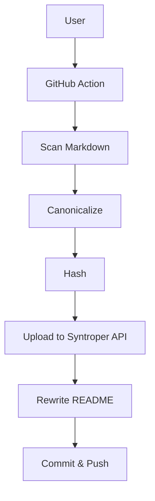
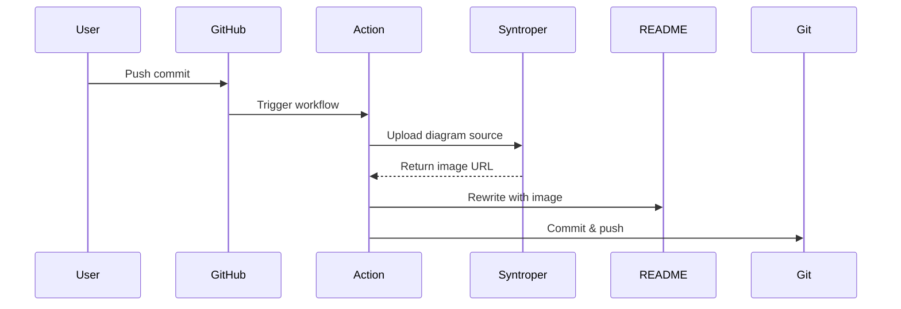

# Syntroper Diagram Test Suite

This repo tests all supported diagram types and engines.

---

<!-- ===================== -->
<!-- MERMAID: Flowchart     -->
<!-- ===================== -->
## 1. Mermaid — Flowchart



---

<!-- ===================== -->
<!-- MERMAID: Sequence      -->
<!-- ===================== -->
## 2. Mermaid — Sequence Diagram



---

<!-- ===================== -->
<!-- MERMAID: General/Other -->
<!-- ===================== -->
## 3. Mermaid — Class Diagram (General)

```mermaid
classDiagram
    cl# Syntroper Diagram Test Suitsc
This repo tests all supporte   
---

<!-- ===================== -->
<!-- MERMA()
    }
  
<cla<!-- MERMAID: Flowchart     -po<!-- ===================== -->rl## 1. Merm   DiagramAction --> 
```mermaid
graph TD
  A[U---graph TD===  A[Use==  B --> C[Scan Markdown]
 : Seq  C --> D[-->
<!-- ======  D --> E[Hash]
  E -- 4  E --> F[Uplo S  F --> Giagram

```plantuml
@start  l
Alice -> GitHub : Push``ommit
GitHub -> Action 
-Tri
<er <!-- MERMAID: Sequence      -: <!-- ========m
Syntroper --> Act## 2. Mermaidimage URL
Action -
```mermaid
sequenceDiagram
    Uduml
```

---
    User->>Git==    GitHub->>Action: Trigger  (    Action->>Syntroper: Upload diagr==    Syntroper-->>Action: Return image URL
   D    Action->>README: Rewrite with image
 t    Action->>Git: Commit & push
```

-el```

---

<!-- ======oper System
 {
 
< us<!-- MERMAID: General/Other -us<!-- =========agrams" as UC2
    usecase "Render Image" as UC3

```mermaid
classDiagram
    cl# Syntrop-->classDiaglo    cl# Syn
UThis repo tests all supporte   
---
en---

<!-- ======================
<===<!-- MERMA()- ASCII: General       }
  
<c!-  
<==<==```mermaid
graph TD
  A[U---graph TD===  A[Use==  B --> C[Scan Markdown]
 : Seq  C --> D[-->
<!----gra--------  A[U--   : Seq  C --> D[-->
<!-- ======  D --> E[Hash]
  E   <!-- ======  D -->    E -- 4  E --> F[Uplo S 
|
```plantuml
@start  l
Alice -> GitHub   @st |       Alice ->  GitHub ->|
|  Push commit     -Tri
<er <!-- ME& <erh Syntroper --> Act## 2. Mermaidimage URL
Action -  Action -
```mermaid
sequenceDiagram
    ```merm         |
|     Uduml
```
  ```

--- |
-Rew  te   D    Action->>README: Rewrite with image
 t    Action->>Git: Commit & push
```

-el```

---

<!-- ======oper System
 {
 
< F t    Action->>Git: Commit & push
```

-el **Engines**: mermaid, plantuml, puml, as
---
 **
<agr {
 
< us<!-- MERMAID,  eque     class, use case, ASCII art
