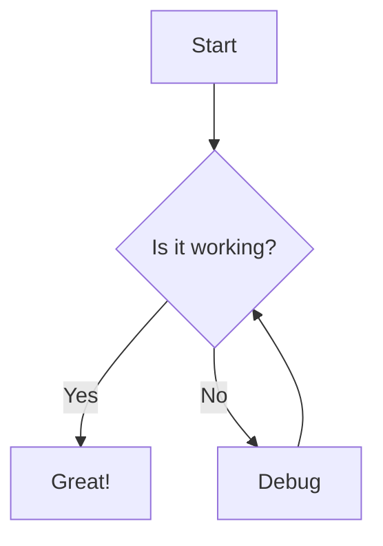
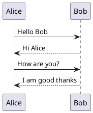

# Syntroper Diagram Test Suite

Push 7 — testing OIDC auth

---

## 1. Mermaid - Flowchart

```mermaid
graph TD
    A[Start] --> B{Is it working?}
    B -->|Yes| C[Great!]
    B -->|No| D[Debug]
    D --> B
```

---

## 2. PlantUML - Sequence Diagram

```plantuml
@startuml
Alice -> Bob: Hello Bob
Bob --> Alice: Hi Alice
Alice -> Bob: How are you?
Bob --> Alice: I am good thanks
@enduml
```
