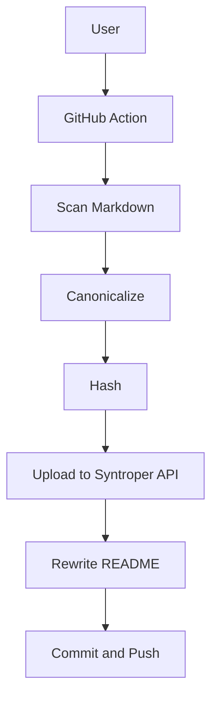
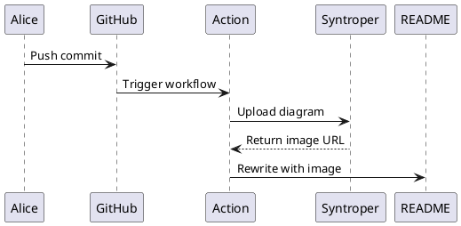

# Syntroper Diagram Test Suite

Push 6 — same blocks, testing dedup/cache

---

## 1. Mermaid - Flowchart

```mermaid
graph TD
  A[User] --> B[GitHub Action]
  B --> C[Scan Markdown]
  C --> D[Canonicalize]
  D --> E[Hash]
  E --> F[Upload to Syntroper API]
  F --> G[Rewrite README]
  G --> H[Commit and Push]
```

---

## 2. PlantUML - Sequence Diagram

```plantuml
@startuml
Alice -> GitHub : Push commit
GitHub -> Action : Trigger workflow
Action -> Syntroper : Upload diagram
Syntroper --> Action : Return image URL
Action -> README : Rewrite with image
@enduml
```
