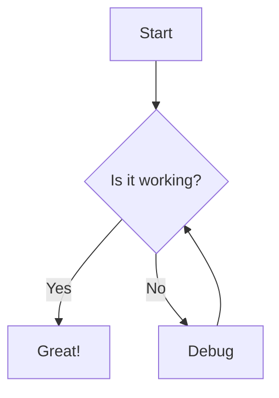

# Syntroper Diagram Test Suite

Push 12 — testing OIDC auth

<!-- syntroper:start -->

Open interactive version on Syntroper.
Use the Syntroper browser extension for inline interactive mode.
<!-- syntroper:diagram canonical=290c8a8ab550f1e48923dd888a90084f16ff654ccfe23ae1b76056e65469098f render=e66dea84716ce5e26916d8465e83e20945bf171aadef3b8d19cc60db76ed8998 id=d8c3f6c5-8538-4bce-a895-521f6043e2a3 engine=mermaid -->
<!-- syntroper:end -->
---
<!-- syntroper:start -->

Open interactive version on Syntroper.
Use the Syntroper browser extension for inline interactive mode.
<!-- syntroper:diagram canonical=290c8a8ab550f1e48923dd888a90084f16ff654ccfe23ae1b76056e65469098f render=e66dea84716ce5e26916d8465e83e20945bf171aadef3b8d19cc60db76ed8998 id=d8c3f6c5-8538-4bce-a895-521f6043e2a3 engine=mermaid -->
<!-- syntroper:end -->
## 1. Mermaid - Flowchart

<!-- syntroper:start -->

Open interactive version on Syntroper.
Use the Syntroper browser extension for inline interactive mode.
<!-- syntroper:diagram canonical=290c8a8ab550f1e48923dd888a90084f16ff654ccfe23ae1b76056e65469098f render=e66dea84716ce5e26916d8465e83e20945bf171aadef3b8d19cc60db76ed8998 id=d8c3f6c5-8538-4bce-a895-521f6043e2a3 engine=mermaid -->
<!-- syntroper:end -->

---

## 2. PlantUML - Sequence Diagram

<!-- syntroper:start -->

Open interactive version on Syntroper.
Use the Syntroper browser extension for inline interactive mode.
<!-- syntroper:diagram canonical=9492f927fab54ef89df535ffa449cc62c6466a595e9373db66a8c61b936a8060 render=9fdd63be1a47b76dd60307aa384e1a11a53a60378c287aaa166f9d69b4595cce id=50242c29-8d56-424a-959f-1a19d45229d4 engine=plantuml -->
<!-- syntroper:end -->
