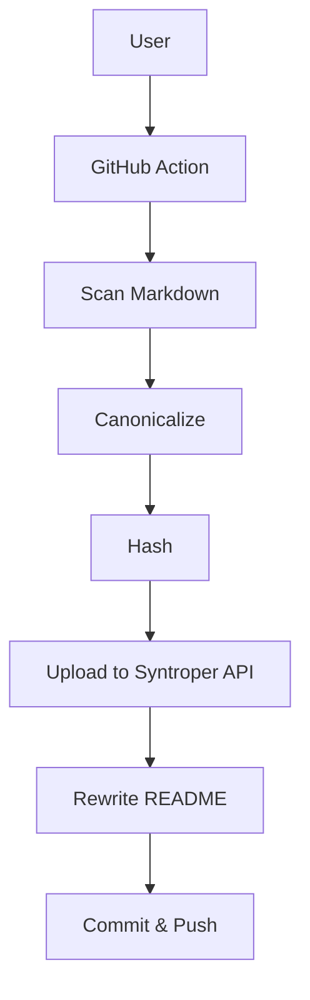
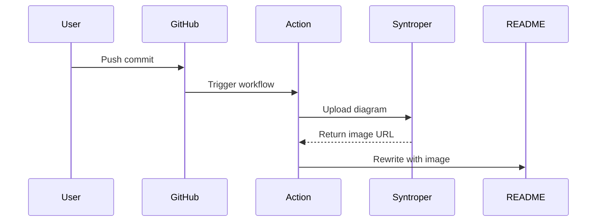

# Readme Analyzer Test

This repo tests the Syntroper diagram action.

## Architecture (Flowchart)

```mermaid
graph TD
  A[User] --> B[GitHub Action]
  B --> C[Scan Markdown]
  C --> D[Canonicalize]
  D --> E[Hash]
  E --> F[Upload to Syntroper API]
  F --> G[Rewrite README]
  G --> H[Commit & Push]
```

## Workflow (Sequence Diagram)

```mermaid
sequenceDiagram
    User->>GitHub: Push commit
    GitHub->>Action: Trigger workflow
    Action->>Syntroper: Upload diagram
    Syntroper-->>Action: Return image URL
    Action->>README: Rewrite with image
```

## Footer

That's it!
