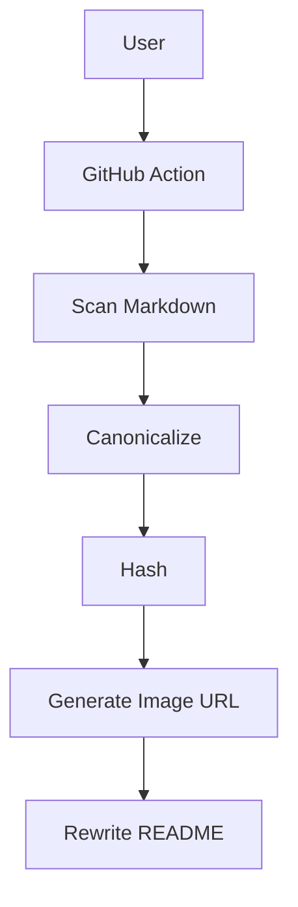
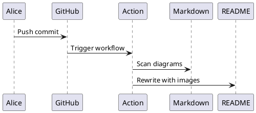

# Readme Analyzer Test

This repo tests the Syntroper diagram action.

## Architecture

```mermaid
graph TD
  A[User] --> B[GitHub Action]
  B --> C[Scan Markdown]
  C --> D[Canonicalize]
  D --> E[Hash]
  E --> F[Generate Image URL]
  F --> G[Rewrite README]
```

## Sequence

```plantuml
@startuml
Alice -> GitHub : Push commit
GitHub -> Action : Trigger workflow
Action -> Markdown : Scan diagrams
Action -> README : Rewrite with images
@enduml
```

## Footer

That's it!
